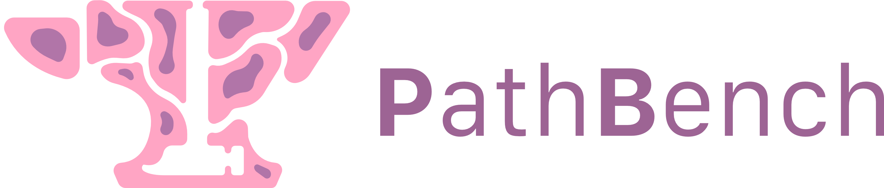
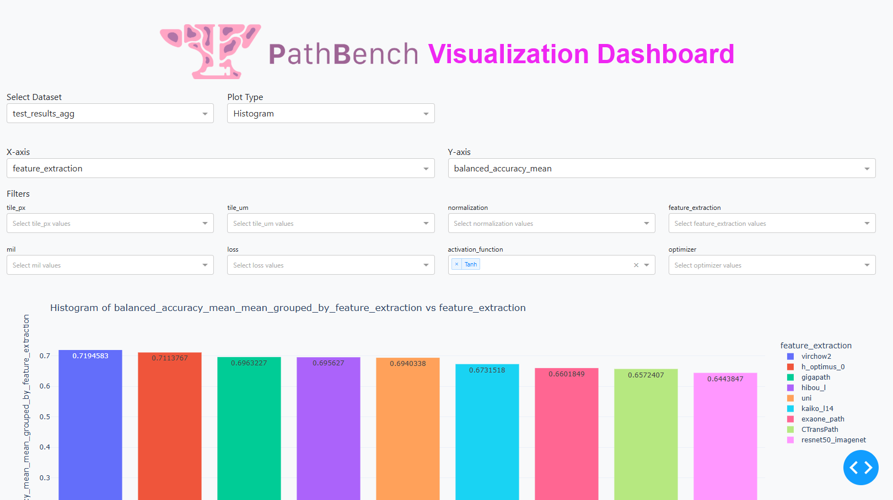
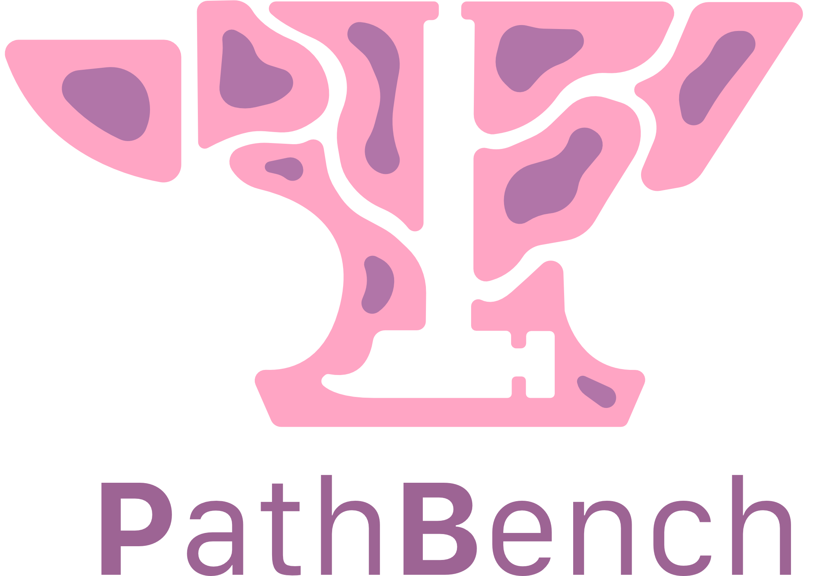

<p align="center">
 
</p>

# PathBench-MIL: A comprehensive, flexible Benchmarking/AutoML framework for multiple instance learning in pathology.

PATHBENCH IS CURRENTLY UNDER DEVELOPMENT, SOME FEATURES MAY NOT WORK AS INTENDED

PathBench is a Python package designed to facilitate benchmarking, experimentation, and optimization of Multiple Instance Learning (MIL) for computational histopathology. It provides tools for conducting experiments, evaluating performance, visualizing results, and optimizing hyperparameters. PathBench is built on top of the excellent [SlideFlow](https://github.com/jamesdolezal/slideflow) package for handling Whole Slide images and integrates Optuna for hyperparameter optimization. PathBench is useful for researchers aiming to benchmarking different pipeline parameters / models for use in their subdomain (in which case the benchmark mode is more suitable) and users starting a Computational Pathology project and wanting to find a suitable pipeline architecture (in which case the optimization mode is more suitable).

PathBench operates in two modes: Benchmark-mode and Optimization-mode. Benchmark mode takes in different options for the computational pipeline (e.g. normalization methods, feature extractors) and benchmarks all possible combinations, outputting a performance table sorted on mode performance. Optimization mode simply aims to find the optimal set of computational pipeline hyperparameters to optimize a set performance objective, it will not test all possible combinations.

One can use PathBench for binary classification, multiclass classification, regression and continuous/discrete survival prediction problems. Multiple datasets can be integrated into a single experiment to allowing for training or testing on different data sources. All user parameters are captured in a single .yaml file.

The output of benchmarking experiments can be loaded into a plotly-based visualization app for further investigation. We also provide a pipeline which calculates the semantic feature similarity between feature bags which can then be used to build model ensembles.

PathBench is being developed at the Leiden University Medical Center: Department of Pathology.
- Lead Developers: Siemen Brussee, Pieter Valkema


## 📖 Citation

If you use **PathBench-MIL** in your research or projects, please cite:

> **Brussee et al.** *PathBench-MIL: A comprehensive, flexible Benchmarking/AutoML framework for multiple instance learning in pathology.*

```bibtex
@software{Brussee_PathBenchMIL,
  author = {Siemen Brussee, Pieter A. Valkema, Thom Doeleman, Anne M.R. Schrader, Jesper Kers},
  title = {PathBench-MIL: A comprehensive, flexible Benchmarking/AutoML framework for multiple instance learning in pathology},
  year = {2024},
  url = {https://github.com/Sbrussee/PathBench-MIL},
  note = {Version 1.0}
}
```

## Table of Contents
- [Local Installation](#installation-guide-for-pathbench)
- [Docker Installation](#running-pathbench-mil-with-docker-with-gpu-support)
- [Setting up a Project](#setting-up-a-project)
- [Configuring PathBench](#pathbench-configuration-example)
- [Running PathBench](#running-pathbench)
- [Features](#features)
- [Extending PathBench](#extending-pathbench)
- [FAQ](#frequently-asked-questions)


## Directory Structure
- pathbench/
  - pathbench/ 
    - benchmarking/
      - benchmark.py # Main benchmarking script
    - experiment/
      - experiment.py # Initialization of experiments
    - models/
      - aggregators.py # MIL aggregation methods
      - feature_extractors.py # Feature extractors
      - slide_level_predictors.py # Slide-level 'aggregators'.
    - utils
      - calculate_feature_similarity.py # Calculate feature extractor similarity
      - utils.py # Util functions
      - losses.py # Houses custom losses for training models
      - metrics.py # Houses custom metrics to calculate during training
    - visualization
      - visualization.py # Houses visualization functions
    - test
      - test.py # Calls testing functions
      - binary_test_conf.yaml # tests binary classification
      - classification_test_conf.yaml # tests multiclass classification
      - opt_test_conf.yaml # tests optimization mode
      - regression_test_conf.yaml # tests regresison
      - survival_test_conf.yaml # tests survival prediciton
  - slideflow_fork # Forked Slideflow package
    - ...
  - requirements.txt
  - README.md
  - LICENSE
  - setup.py # Main setup script for pip
  - setup_pathbench.py # Script to setup a virtual environment and install base packages
  - run_pathbench.sh # Bash script to run pathbench
  - conf.yaml # Default configuration

# Installation Guide for PathBench

## Prerequisites

- Python >= 3.10
- Git

## Steps to Install PathBench and SlideFlow Fork

1. **Clone the Repository:**

    ```bash
    git clone --recurse-submodules https://github.com/sbrussee/PathBench-MIL.git
    cd PathBench-MIL
    ```

2. **Run `setup_pathbench.py`:**

    Run the existing script to set up the virtual environment and install necessary tools.

    ```bash
    python setup_pathbench.py
    ```

    This script will:
    - Create a virtual environment named `pathbench_env`.
    - Upgrade `pip` and install `setuptools`, `wheel`, and `versioneer`.

3. **Activate the Virtual Environment:**

    - macOS/Linux:
        ```bash
        source pathbench_env/bin/activate
        ```
    - Windows:
        ```bash
        pathbench_env\Scripts\activate
        ```
4. **Install `slideflow` Package:**

    Navigate to the `slideflow_fork` directory and install it:

    ```bash
    cd slideflow_fork
    pip install -e .
    ```

    Or, if you do not need to modify the code:

    ```bash
    pip install .
    ```
    
5. **Install `pathbench-mil` Package:**

    After activating the virtual environment, install the `pathbench-mil` package.

    First, move back to the pathbench-mil main directory:
    ```bash
    cd ..
    ```

    Then, run:
    ```bash
    pip install -e .
    ```

    Or, if you do not need to modify the code:

    ```bash
    pip install .
    ```

# Running PathBench-MIL with Docker (with GPU Support)
This guide explains how to build and run the PathBench-MIL repository using Docker with GPU support. It includes instructions for both command-line (CLI) users and those who prefer Docker Desktop's user interface (UI).

## Prerequisites
Before using Docker with GPU support, ensure you have the following installed:

1. Install Docker
### Docker Desktop (Windows/macOS):
Download and install [Docker Desktop](https://www.docker.com/products/docker-desktop/)

- Windows users: Enable WSL2-based engine in Docker settings.
- macOS users: Ensure Rosetta is installed if using Apple Silicon.

### Docker Engine (Linux):
Install Docker using the following:

```bash
sudo apt-get update
sudo apt-get install -y docker.io
```
2. Install NVIDIA GPU Support (Linux Only)
For GPU acceleration, install NVIDIA Drivers and nvidia-container-toolkit:

```bash
sudo apt-get install -y nvidia-container-toolkit
sudo systemctl restart docker
```
More details: [NVIDIA Container Toolkit](https://developer.nvidia.com/cuda-toolkit)

## Building the Docker Image
Navigate to the root of your repository (where the Dockerfile is located).

### Command-Line (CLI) Method
Run the following:

```bash
docker build -f pathbench-gpu.Dockerfile -t pathbench-gpu .
```
### Docker Desktop (UI) Method
1) Open Docker Desktop.
2) Click on "Containers" > "Build a new image".
3) Select the directory containing the Dockerfile.
4) Set the image name to pathbench-gpu.
5) Click "Build".

## Running the Container
You can run the container either from the command line or using Docker Desktop.

### Command-Line (CLI) Method
Option A: Mount a Custom Config File
If you want to override conf.yaml inside the container, run:

```bash
docker run --gpus all -it --rm \
  -v /path/to/custom/conf.yaml:/app/PathBench-MIL/conf.yaml \
  pathbench-gpu bash
```
Option B: Mount the Entire Repository
To modify all files in /app/PathBench-MIL:

```bash
docker run --gpus all -it --rm \
  -v /path/to/local/PathBench-MIL:/app/PathBench-MIL \
  pathbench-gpu bash
```
### Docker Desktop (UI) Method
1) Open Docker Desktop.
2) Click "Containers" > "Run New Container".
3) Select the pathbench-gpu image.
4) Under "Volumes", add:
- Host path: /path/to/custom/conf.yaml
- Container path: /app/PathBench-MIL/conf.yaml
5) Under "Advanced settings":
6) Enable GPU support.
7) Set the mode to interactive.
8) Click "Run".

## Mounting External Slide Directories & Annotation Files
To work with external Whole Slide Images (WSIs) and annotation files, mount their directories:

### Command-Line (CLI) Method
```bash
docker run --gpus all -it --rm \
  -v /path/to/slides:/mnt/slides \
  -v /path/to/annotations.csv:/mnt/annotations.csv \
  pathbench-gpu bash
```
- /path/to/slides: Replace with the actual path to your WSI directory.
- /path/to/annotations.csv: Path to the annotation file.

Inside the container, access:
```bash
ls -lah /mnt/slides
cat /mnt/annotations.csv
```
### Docker Desktop (UI) Method
1) Open Docker Desktop.
2) Click "Run New Container".
3) Under "Volumes", add:
- Host Path: /path/to/slides
- Container Path: /mnt/slides
- Host Path: /path/to/annotations.csv
- Container Path: /mnt/annotations.csv
4) Click "Run".

## Modifying Config and Running PathBench
Once inside the container, you can edit conf.yaml:

```bash
nano conf.yaml
```
If nano is not installed:

```bash
apt-get update && apt-get install -y nano
```

## Setting Slide Backend
Inhereting from SlideFlow, we use the CuCIM backend by default. This is a fast framework but does not support *.scn, *.mrxs, *.ndpi, *.vms, and *.vmu WSIs. For PathBench-MIL to work with these slide types please set:
```export SF_SLIDE_BACKEND=libvips```
which will use libvips instead of CuCIM. Note that this requires the [libvips](https://github.com/libvips/libvips) package.

## Run PathBench
Execute, inside the docker container:
```bash
bash run_pathbench.sh
```
This script:

1) Activates the virtual environment.
2) Sets SlideFlow backend variables.
3) Runs main.py using conf.yaml.

## Running Prebuilt Docker Image (Docker Hub)
To skip building from scratch, pull and run the prebuilt image from Docker Hub.

Pull Image:
```bash
docker pull sbrussee/pathbench-mil
```

### Run Container
```bash
docker run --gpus all -it --rm \
  -v /path/to/slides:/mnt/slides \
  -v /path/to/annotations.csv:/mnt/annotations.csv \
  your-dockerhub-user/pathbench-gpu bash
```

# Setting up a Project
PathBench inherits the project functionality from SlideFlow. PathBench allows creating projects through the configuration file. In the configuration, project-specific settings can be specified in the `experiment` section. The `experiment` section also saves several other important settings:

### Project-related settings:

- `project_name`: The name of the project.
- `annotation_file`: The path to the annotation file.


### Training-related settings:

- `balancing`: The balancing technique to be used. This can be `tile`, `slide`, `patient`, or `category`. Balancing is used to construct training batches with a balanced distribution of classes/patients/slides/tiles.
- `split_technique`: The split technique to be used. This can be `k-fold` or `fixed`.
- `k`: The number of folds for k-fold cross-validation.
- `val_fraction`: The fraction of the training data to be used for validation.
- `best_epoch_based_on` : measure to base the epoch selection for selecting the optimal model state on. Can be 'val_loss', any of the task default metrics (roc_auc_score, c_index, r2_score), or any of the custom metrics defined.
- `epochs`: The number of epochs for training.
- `batch_size`: The batch size for training.
- `bag_size`: The bag size for MIL models.
- `aggregation_level`: The aggregation level can be `slide` or `patient`. This specifies at which levels bags are aggregated, effectively creating slide-level or patient-level predictions.
- `encoder_layers` : The number of layers used for the encoder in the MIL aggregator
- `z_dim` : The dimensionality of the latent space in the MIL encoder.
- `dropout_p` : The dropout probability in the MIL model.
- `class_weighting`: Whether to weight the instances for each class during training based on occurence.
  
### General settings:

- `task`: The task can be `classification`, `regression`, `survival` or 'survival_discrete'.
- `mode`: The mode can be either `benchmark` or `optimization`.
- `num_workers` : Number of workers for parallelization, set to 0 to disable parallel processing.
- `custom_metrics` : List of custom metrics to be used, which should be defined in metrics.py or as a fastai-metric: https://docs.fast.ai/metrics.html
- `report` : Whether to output a slide processing report (see Slideflow documentation). Reports will be saved in the tfrecords directory of the corresponding tiles in PDF format.
- `mixed_precision` : Whether to extract features in mixed precision (fp16) mode, reducing GPU requirements.
- `skip_extracted` : Whether to force re-extraction of tiles from WSIs, even if already available. If set to True, will skip re-extraction if tiles are available.
- `skip_feature_extraction`: Whether to force re-extraction of features from tfrecord tiles. If set to True, will skip re-extraction if features are available.
- `save_tiles`: Whether to save .jpg images of each tile in addition to the .tfrecord formatted tiles.
- `multiprocessing_context` : Which multiprocessing mode to use ('fork' or 'spawn')
- `persistent_workers` : Whether dataloaders should keep multiprocesses alive across batches
- `experiment_label` : Label to use for the current experiment. Results will be saved using this label.

# Datasets
The datasets to be used in the project can be specified in the datasets section. One can add any arbitrary number of data sources to a project and specify whether these should be used for training/validation or as testing datasets:
```yaml
datasets:  # List of datasets to be used
  - name: dataset1  # Name of the dataset
    slide_path: path/to/your/slides  # Path to the slide data
    tfrecord_path: path/to/save/tfrecords  # Path to save tfrecords
    tile_path: path/to/save/tiles  # Path to save tiles
    used_for: training  # Whether the dataset is used for training or testing

  - name: dataset2
    slide_path: path/to/your/other/slides
    tfrecord_path: path/to/other/tfrecords
    tile_path: path/to/other/tiles
    used_for: testing
```

# Annotations
The annotation file should be a CSV file with the following columns:

- slide: The name/identifier of the slide, **without the file extension (e.g. .svs, .tiff)**.
- patient: The name/identifier of the patient to which the slide corresponds.
- dataset: The name of the dataset to which the slide belongs.
For classification tasks, the annotation file should also contain a column with the target labels. This column should be named category. For regression tasks, the annotation file should contain a column with the target values. This column should be named value. For survival tasks, the annotation file should contain columns with the survival time and event status. These columns should be named time and event, respectively.

Example of a valid annotation file for a classification task, assuming we use two datasets: dataset1 and dataset2:
```csv
slide,patient,dataset,category
slide1,patient1,dataset1,0
slide2,patient1,dataset1,1
slide3,patient2,dataset1,0
slide4,patient2,dataset1,1
slide5,patient3,dataset1,0
slide6,patient3,dataset1,1
slide7,patient4,dataset2,0
slide8,patient4,dataset2,1
slide9,patient5,dataset2,0
slide10,patient5,dataset2,1
```

For a regression task:
```csv
slide,patient,dataset,value
slide1,patient1,dataset1,0.1
slide2,patient1,dataset1,0.2
slide3,patient2,dataset1,0.3
slide4,patient2,dataset1,0.4
slide5,patient3,dataset1,0.5
slide6,patient3,dataset1,0.6
slide7,patient4,dataset2,0.7
slide8,patient4,dataset2,0.8
slide9,patient5,dataset2,0.9
slide10,patient5,dataset2,1.0
```

For a continuous survival task, where time is a number of days/weeks/months/years and event expects 1 for patient which are dead (event occured) and 0 for those that are alive (event not occured).:
```csv
slide,patient,dataset,time,event
slide1,patient1,dataset1,26,1
slide2,patient1,dataset1,15,1
slide3,patient2,dataset1,16,1
slide4,patient2,dataset1,42,0
slide5,patient3,dataset1,13,1
slide6,patient3,dataset1,11,1
slide7,patient4,dataset2,6,0
slide8,patient4,dataset2,5,1
slide9,patient5,dataset2,84,1
slide10,patient5,dataset2,43,1
```

For a discrete survival task, we bin the time column into bins (e.g. quantiles):
```csv
slide,patient,dataset,time,event
slide1,patient1,dataset1,3,1
slide2,patient1,dataset1,2,1
slide3,patient2,dataset1,2,1
slide4,patient2,dataset1,3,0
slide5,patient3,dataset1,2,1
slide6,patient3,dataset1,2,1
slide7,patient4,dataset2,1,0
slide8,patient4,dataset2,1,1
slide9,patient5,dataset2,1,1
slide10,patient5,dataset2,3,1
```

# PathBench Configuration Example
To use PathBench, you need to provide a configuration file in YAML format. Below is an example configuration file:

```yaml
experiment:
  project_name: Example_Project # Name of the project, where the results will be saved
  annotation_file: /path/to/your/annotation_file.csv # Path to the annotation file
  balancing: category # Training set balancing strategy, can be None, category, slide, patient or tile.
  class_weighting: False # Boolean denoting whether to weight instances based on class occurence during model training
  num_workers: 0 # Number of workers for data loading, 0 for no parallelization.
  split_technique: k-fold # Splitting technique, can be k-fold, k-fold-stratied (stratifies folds across 'dataset' column) or fixed
  epochs: 5 # Number of training epoch
  best_epoch_based_on: val_loss # Metric to be used for selecting the best training epoch (e.g. val_loss, roc_auc_score, mae, concordance_index)
  batch_size: 32 # Batch size
  bag_size : 512 # Bag size for MIL
  encoder_layers: 1 # Number of encoder layers to use in the MIL aggregator
  z_dim: 256 # Latent space dimensionality in the MIL aggregator
  dropout_p: 0.1 # Dropout probabilitiy in the MIL aggregator
  k: 2 # Number of folds, if split-technique is k-fold
  val_fraction: 0.1 # Fraction of training data to use for validation
  aggregation_level: slide # Aggregation level, can be slide or patient
  task: classification # Task, can be classification, regression, survival or survival_discrete
  mode: benchmark # Mode can be either 'benchmark', 'optimization' or 'feature_extraction'
  mixed_precision: False # Whether to retrieve features in mixed precision (fp16), which is useful for situations with gigantic models and limited GPU-VRAM)
  report: False # Boolean denoting whether to provide a tile processing report
  skip_extracted: True # Whether to skip the tile extraction step if tiles already exist
  skip_feature_extraction: True # Whether to skip the feature extraction step if features already exist
  save_tiles: False # Whether to save the extracted tile images as .jpg files in addition to the .tfrecords
  experiment_label: exp1 # Experiment label to use.


  visualization: # Visualization options, options: CLASSIFICATION: confusion_matrix, precision_recall_curve, roc_curve, top_tiles SURVIVAL: survival_roc, concordance_index, kaplan_meier REGRESSION: predicted_vs_actual, residuals, qq
    - learning_curve
    - confusion_matrix
    - roc_curve

  evaluation: # Evaluation metrics to use. options: CLASSIFICATION: balanced_accuracy, mean_f1, mean_uncertainty, auc, mean_average_precision, mean_average_recall. REGRESSION: mean_absolute_error, mean_squared_error, r2_score. SURVIVAL/DISCRETE SURVIVAL: c_index, brier_score.
    - balanced_accuracy
    - auc
  mode: optimization # Mode to use, either benchmark or optimization

  custom_metrics: [RocAuc]: List of evaluation metrics to measure in the validation set during model training. Needs to be either specified in metrics.py or a fastai metric: https://docs.fast.ai/metrics.html

  qc: # List of quality control methods to be used, supports Otsu, Gaussian, GaussianV2 and Otsu-CLAHE
    - GaussianV2 # Faster version of Gaussian blur tissue detection
    - Otsu-CLAHE # Otsu thresholding tissue detection with CLAHE-enhanced V-channel in HSV space for increased contrast.

  qc_filters: #Tile-level filters for discarding tiles
    - grayspace_threshold : 0.05 #Pixels below this value (ranged 0-1) are considered gray.
    - grayspace_fraction: 0.6 # Image tiles with grayspace above this fraction are discarded.
    - whitespace_threshold: 230 #Pixel intensities (0-255) above this value are considered white.
    - whitespace_fraction: 1.0 # Image tiles with whitespace above this fraction are discarded.

optimization:
  study_name: Exp1 # Name of the optimization study
  load_study: True # Whether to load an existing study, which continues the optimization from a checkpoint
  objective_metric: balanced_accuracy # Objective metric to optimize, should also be specified in 'evaluation'
  objective_mode: max # Optimization mode, can be 'max' or 'min'
  objective_dataset: test # Dataset to be used for the objective metric, can be 'val' or 'test'
  sampler: TPESampler # Algorithm to use for optimization: grid_search, TPE, Bayesian
  trials: 100 # Number of optimization trials
  pruner: HyperbandPruner # Pruner for optimization, can be Hyperband, Median etc. Remove this line if you do not want to use a pruner.

datasets: # List of datasets to use, each dataset should have a name, slide_path, tfrecord_path, tile_path and used_for.
  - name: dataset_1
    slide_path: /path/to/your/dataset_1/slides
    tfrecord_path: /path/to/your/dataset_1/tfrecords
    tile_path: /path/to/your/dataset_1/tiles
    used_for: training

  - name: dataset_2
    slide_path: /path/to/your/dataset_2/slides
    tfrecord_path: /path/to/your/dataset_2/tfrecords
    tile_path: /path/to/your/dataset_2/tiles
    used_for: testing

benchmark_parameters: # Parameters for the benchmarking, can be used to compare different methods
  tile_px: # Tile size in pixels
    - 256

  tile_um: # Tile size (magnification str (e.g 20x, 40x) or microns integer (150, 250))
    - 20x

  normalization: # Normalization method, can be macenko, reinhard, ruifrok or cyclegan
    - macenko
    - reinhard

  feature_extraction: # Feature extraction methods
    - resnet50_imagenet
    - hibou_b

  mil: # Multiple instance learning aggregation methods
    - Attention_MIL
    - dsmil

  loss: # Loss functions, as specified in losses.py
    - CrossEntropyLoss

  activation_function: # activation function for the MIL encoder, supports any pytorch.nn activation function.
    - ReLU

  optimizer: # Optimization algorithm to use for model training (Can be any FastAI optimizer)
    - Adam

# Available normalization methods:
# - macenko
# - reinhard
# - cyclegan

# Available feature extraction methods:
# - resnet50_imagenet
# - CTransPath
# - transpath_mocov3
# - RetCCL
# - PLIP
# - HistoSSL
# - uni
# - uni_h
# - conch
# - dino
# - mocov2
# - swav
# - phikon
# - phikon_v2
# - gigapath
# - barlow_twins
# - hibou_b
# - hibou_l
# - pathoduet_ihc
# - pathoduet_he
# - kaiko_s8
# - kaiko_s16
# - kaiko_b8
# - kaiko_b16
# - kaiko_l14
# - h_optimus_0
# - h_optimus_1
# - h0_mini
# - virchow
# - virchow2
# - exaone_path
# - keep
# - mstar
# - lunit_onco_fm
# - midnight
# SLIDE LEVEL MODELS:
# - gigapath_slide
# - titan_slide
# - prism_slide

# Available MIL aggregation methods:
# - clam_mil
# - clam_mil_mb
# - Attention_MIL
# - transmil
# - bistro.transformer
# - linear_mil
# - mean_mil
# - max_mil
# - lse_mil
# - lstm_mil
# - deepset_mil
# - distributionpooling_mil
# - dsmil
# - varmil
# - perceiver_mil
# - air_mil
# - topk_mil
# - weighted_mean_mil
# - gated_attention_mil
# - il_mil


#Available Loss functions
  # - Classification:
     # - CrossEntropyLoss
     # - FocalLoss
     # - LabelSmoothingCrossEntropyLoss
     # - CrossEntropyWithEntropyMinimizationLoss
     # - AttentionEntropyMinimizedCrossEntropyLoss
     # - DiversityRegularizedCrossEntropyLoss
     # - SparseAttentionCrossEntropyLoss
 # - Survival (Continuous):
     # - RankingLoss
     # - CoxPHLoss
     # - ExponentialConcordanceLoss
 # - Survival (Discrete):
     # - NLLLogisticHazardLoss
     # - NLLPMFLoss
     # - NLLMTLRLoss
     # - BCESurvLoss
     # - DeepHitLoss
     # - AdaptedCrossEntropySurvivalLoss
# - Regression
     # - MSELossReg
     # - L1LossReg
     # - HuberLossReg

weights_dir : ./pretrained_weights # Path to the model weights, and where newly retrieved model weights will be saved, defaults to the pretrained_weights directory in the PathBench directory.
hf_key: YOUR_HUGGINGFACE_TOKEN # Token for Hugging Face model hub to access gated models, if you do not have one, just set to None

```

# Running PathBench
To run pathbench once installed using default setting, one can simply run
```bash
./run_pathbench.sh
```

Note that this script sets the configuration file as well as the name of the virtual environment, which can be changed:
```bash
#If virtual environment does not exist, construct one using pip
if [ ! -d "pathbench_env" ]; then
    python3 -m venv pathbench_env
    source pathbench_env/bin/activate
    pip install --upgrade pip
    pip install -r requirements.txt
else
    source pathbench_env/bin/activate
fi

#Set slideflow backends
export SF_SLIDE_BACKEND=cucim
export SF_BACKEND=torch

#Set the config file
CONFIG_FILE=conf.yaml

#Run the program
python3 main.py $CONFIG_FILE
```
# Features
- Support for binary/multiclass classification, regression and continuous/discretized time-to-event (e.g. survival prediction) problems.
- Support for fast multi-GPU tile-level and slide-level feature extraction.
- Benchmarking w.r.t.
    - Tile sizes, magnifications (e.g. 256px, 20x)
    - Normalization methods (e.g. Macenko, Reinhard)
    - Feature extractors (e.g. UNI, GigaPath)
    - MIL aggregators (e.g. CLAM, DSMIL)
    - Loss functions
    - Activation functions
    - Optimization methods
- Interpretable visualizations of benchmark output
- Plotly-based benchmark visualization tool
- Efficient Tile processing and QC pipeline inherited by Slideflow
- Optuna-based AutoML optimization w.r.t. the benchmark parameters, to quickly find good candidate solutions.

## Normalization
PathBench currently supports:
- Macenko
- Reinhard
- CycleGan

normalization.
## Feature Extractors
PathBench supports a wide range of different feature extractors, including SOTA foundation models for pathology. Most of these models are automatically downloaded by PathBench, however, some models require a huggingface account key to access the model (labeled 'Gated' in the feature extraction table) or require manually downloading the model weights (labeled 'Manual' in the extraction table). For each of the models, a link to the publication is given, and for the manual/gated models, the link for downloading the models or gaining model access are also provided.

| Feature Extractor | Acquisition | Link |
|----------|----------|----------|
| ImageNet-ResNet50 | Automatic | NA | 
| CTransPath | Automatic | [Link](https://github.com/Xiyue-Wang/TransPath?tab=readme-ov-file) |
| MoCoV3-TransPath | Automatic | [Link](https://github.com/Xiyue-Wang/TransPath?tab=readme-ov-file) |
| HistoSSL | Automatic | [Link](https://github.com/owkin/HistoSSLscaling) |
| RetCCL | Automatic | [Link](https://github.com/Xiyue-Wang/RetCCL) |
| PLIP | Automatic | [Link](https://github.com/PathologyFoundation/plip?tab=readme-ov-file) |
| Lunit DINO | Automatic | [Link](https://github.com/lunit-io/benchmark-ssl-pathology) |
| Lunit SwAV | Automatic | [Link](https://github.com/lunit-io/benchmark-ssl-pathology)  |
| Lunit Barlow Twins | Automatic | [Link](https://github.com/lunit-io/benchmark-ssl-pathology) |
| Lunit MocoV2 | Automatic | [Link](https://github.com/lunit-io/benchmark-ssl-pathology)  |
| Phikon | Automatic | [Link](https://huggingface.co/owkin/phikon) |
| Phikon-V2 | Automatic | [Link](https://huggingface.co/owkin/phikon-v2) |
| PathoDuet-HE | Manual | [Link](https://github.com/openmedlab/PathoDuet) [Weights](https://drive.google.com/drive/folders/1aQHGabQzopSy9oxstmM9cPeF7QziIUxM)|
| PathoDuet-IHC | Manual | [Link](https://github.com/openmedlab/PathoDuet) [Weights](https://drive.google.com/drive/folders/1aQHGabQzopSy9oxstmM9cPeF7QziIUxM)|
| Virchow | Gated | [Link](https://huggingface.co/paige-ai/Virchow)|
| Virchow2 | Gated | [Link](https://huggingface.co/paige-ai/Virchow2) |
| Hibou-B | Automatic | [Link](https://huggingface.co/histai/hibou-b) |
| Hibou-L | Gated | [Link](https://huggingface.co/histai/hibou-L)
| UNI | Gated | [Link](https://huggingface.co/MahmoodLab/UNI) |
| UNI-H | Gated | [Link](https://huggingface.co/MahmoodLab/UNI2-h) |
| CONCH | Gated | [Link](https://huggingface.co/MahmoodLab/CONCH) |
| Prov-GigaPath | Gated | [Link](https://huggingface.co/prov-gigapath/prov-gigapath) |
| Kaiko-S8 | Automatic | [Link](https://github.com/kaiko-ai/towards_large_pathology_fms) |
| Kaiko-S16 | Automatic | [Link](https://github.com/kaiko-ai/towards_large_pathology_fms) |
| Kaiko-B8 | Automatic | [Link](https://github.com/kaiko-ai/towards_large_pathology_fms) |
| Kaiko-B16 | Automatic | [Link](https://github.com/kaiko-ai/towards_large_pathology_fms) |
| Kaiko-L14 | Automatic | [Link](https://github.com/kaiko-ai/towards_large_pathology_fms) |
| Midnight | Automatic | [Link](https://huggingface.co/kaiko-ai/midnight)
| H-Optimus-0 | Automatic | [Link](https://huggingface.co/bioptimus/H-optimus-0) |
| H-Optimus-1 | Gated | [Link](https://huggingface.co/bioptimus/H-optimus-1) |
| H0-mini | Gated | [Link](https://huggingface.co/bioptimus/H0-mini) |
| KEEP | Automatic | [Link](https://huggingface.co/Astaxanthin/KEEP) |
| EXAONEPath | Gated | [Link](https://huggingface.co/LGAI-EXAONE/EXAONEPath) |
| mSTAR | Gated | [Link](https://huggingface.co/Wangyh/mSTAR) |

## MIL aggregators
In addition to a wide range of feature extractors, PathBench also includes a wide variety of MIL aggregation methods.

| MIL aggregator | Link |
|----------|----------|
| CLAM-SB | [Link](https://github.com/mahmoodlab/CLAM) |
| CLAM-MB | [Link](https://github.com/mahmoodlab/CLAM)  |
| Attention MIL | [Link](https://github.com/AMLab-Amsterdam/AttentionDeepMIL)|
| TransMIL |  [Link](https://github.com/szc19990412/TransMIL) |
| HistoBistro Transformer | [Link](https://github.com/peng-lab/HistoBistro) |
| Linear MIL | NA |
| Mean MIL | NA |
| Max MIL  NA |
| Log-Sum-Exp MIL | NA |
| LSTM-MIL | NA |
| DeepSet-MIL | [Link](https://github.com/manzilzaheer/DeepSets)|
| Distribution-pool MIL | NA |
| VarMIL |  [Link](https://github.com/NKI-AI/dlup-lightning-mil)|
| DSMIL |  [Link](https://github.com/binli123/dsmil-wsi)  |
| PERCEIVER-MIL | [Link](https://arxiv.org/abs/2103.03206) |
| Adaptive Instance Ranking (AIR)-MIL | NA |
| TopK-MIL | NA |
| Weighted Mean MIL |  NA |
| Gated Attention MIL |  NA |
| Instance-Level (IL)-MIL |  NA |


## PathBench outputs
PathBench-MIL outputs a variety of visualizations and output tables with the performance metrics on the specified validation and testing datasets. Additionally, pathbench will automatically select the best performing model for each benchmarking/optimization experiment and save it for later use. Inference on this saved model can be performed using the utils/inference.py function, as explained below:

Make sure your model directory has the following structure (the critical file is mil_params.json):
```
experiments/{exp_name}/saved_models/best_test_model_{datetime}/
    ├── attention/
    ├── models/
    ├── history.csv
    ├── mil_params.json
    ├── predictions.parquet
    └── slide_manifest.csv
```
It is also possible to use any of the models saved in experiments/{exp_name}/mil as inference input.

Run the Script:

For a single slide:
```bash
python utils/inference.py --model_dir /experiments/some_exp/saved_models/best_test_model_2023-05-27_12-34-56 --slide /path/to/slide.svs
```
For a directory of slides (with attention scores):
```bash
python utils/inference.py --model_dir /experiments/some_exp/saved_models/best_test_model_2023-05-27_12-34-56 --slide_dir /path/to/slides/ --attention
```

The script will save the predictions (and optionally attention values) for each slide:
- Predictions are saved as a .npy file (e.g., slide1_predictions.npy).
- If the --attention flag is used and attention scores are returned, they are saved as a separate .npy file (e.g., slide1_attention.npy).

## Interactive Visualization
PathBench-MIL provides an interactive plotly-dash application that can be used to investigate benchmarking/optimization results. 
By running:
```bash
python3 pathbench/visualization/vis_app.py --results /path/to/directory/with/results/
```
you can visualize PathBench's aggregated output files using the visualization application in your browser, which should look like this:

<p align="center">
  
</p>

## Inference
PathBench-MIL allows you to run inference on new Whole Slide Images (WSIs) using any previously trained model stored under:
```experiments/{experiment_name}/mil```
Running inference will output:
- preds.npy: The prediction for the slide.
- attn.npy (optional): The attention scores if the MIL model supports attention.
- Slide heatmap (optional): A visual overlay of attention scores across the slide.
You can run inference for either a single slide or a directory of slides.
Example: Single Slide with Attention Heatmap
```
python3 pathbench/utils/inference.py \
    --slide path/to/slide.tiff \
    --model_dir experiments/exp1/mil/00217-256_128_macenko_h_optimus_0_1 \
    --cmap bwr \
    --heatmap \
    --config /path/to/conf.yaml
```
Example: Directory of Slides
```
python3 pathbench/utils/inference.py \
    --slide_dir /path/to/slides/ \
    --model_dir /path/to/experiment/mil/best_model/ \
    --config /path/to/conf.yaml \
    --heatmap
```
The script supports customizable heatmap visualization with options:
- --interpolation: e.g., bicubic, bilinear
- --cmap: Matplotlib colormap, e.g., inferno, bwr
- --norm: Use two_slope for diverging heatmaps centered at 0

The results are saved in the inference_results folder, including prediction vectors and heatmaps.

# Extending PathBench
PathBench is designed such that it easy to add new feature extractors and MIL aggregation models. 
1. **Custom Feature Extractors**
New feature extractors are added to pathbench/models/feature_extractors.py and follow this format:
```python
@register_torch
class kaiko_s8(TorchFeatureExtractor):
    """
    Kaiko S8 feature extractor, with small Vision Transformer backbone

    Parameters
    ----------
    tile_px : int
        The size of the tile

    Attributes
    ----------
    model : VisionTransformer
        The Vision Transformer model
    transform : torchvision.transforms.Compose
        The transformation pipeline
    preprocess_kwargs : dict
        The preprocessing arguments

    Methods
    -------
    dump_config()
        Dump the configuration of the feature extractor
    """
    tag = 'kaiko_s8'

    def __init__(self, tile_px=256, **kwargs):
        super().__init__(**kwargs)

        self.model = torch.hub.load("kaiko-ai/towards_large_pathology_fms", 'vits8', trust_repo=True)

        self.model.to('cuda')
        self.num_features = 384
        self.transform = transforms.Compose(
            [
                transforms.Resize(224),
                # Transform to float tensor
                transforms.ConvertImageDtype(torch.float32),
                transforms.Normalize(mean=(0.5, 0.5, 0.5), std=(0.5, 0.5, 0.5)),
            ]
        )
        self.model.eval()
        # Slideflow standardization
        self.preprocess_kwargs = {'standardize': False}

    def dump_config(self):
        return {
            'class': 'kaiko_s8',
            'kwargs': {}
        }
```
Feature extractor models require a @register_torch descriptor to be recognizable by PathBench as a specifiable feature extractor. Furthermore, the class requires a model to be specified, the embedding size to be specified and a transformation pipeline. For more information, please see the [slideflow documentation](https://slideflow.dev/).

### Slide-Level Feature Extractors
In addition to patch-level MIL pipelines, PathBench supports slide-level feature extractors, designed for encoding entire slides directly from tile embeddings and their coordinates.
To define a slide-level extractor, add 'slide' to its class name and inherit from SlideFeatureExtractor.
Example:
```
@register_torch
class titan_slide(SlideFeatureExtractor):
    tag = 'titan_slide'

    def __init__(self, tile_px: 256, **kwargs):
        ...
        self.build_encoders()
        self.tile_px = tile_px
        self.model = self.tile_encoder
        self.num_features = 768
        ...
```
Such extractors must implement a forward_slide method:
```
def forward_slide(self, tile_features, tile_coordinates, **kwargs):
    ...
    return slide_embedding
```
These do not use MIL aggregators. Instead, they require slide-level prediction heads, defined in slide_level_predictors.py. PathBench will automatically fall back to mlp_slide_classifier if a MIL aggregator is incorrectly paired with a slide-level extractor.
Slide-Level Head Model Example
```
class mlp_slide_classifier(nn.Module):
    def __init__(self, n_feats, n_out, encoder_layers, z_dim, ...):
        ...
    def forward(self, x):
        latent = self.encoder(x)
        return self.head(latent)
```
2. **Custom MIL aggregators**
Adding MIL aggregation methods is done similarly, but in the pathbench/models/aggregators.py script:
```python
class lse_mil(nn.Module):
    """
    Multiple instance learning model with log-sum-exp pooling.

    Parameters
    ----------
    n_feats : int
        Number of input features
    n_out : int
        Number of output classes
    z_dim : int
        Dimensionality of the hidden layer
    dropout_p : float
        Dropout probability
    r : float
        scaling factor for log-sum-exp pooling
    activation_function : str
        activation function to use (as present in pytorch), given as a string
    encoder_layers: int
        number of encoder layers to use.
    goal: str
        overall goal of the model (classification, regression, survival, survival_discrete), used to account for different output requirements.
    
    Attributes
    ----------
    encoder : nn.Sequential
        Encoder network
    head : nn.Sequential
        Prediction head network
    r : float
        scaling factor for log-sum-exp pooling

    Methods
    -------
    forward(bags)
        Forward pass through the model
    
    """

def __init__(self,
                 n_feats: int,
                 n_out: int,
                 z_dim: int = 256,
                 dropout_p: float = 0.1,
                 r: float = 1.0,
                 activation_function='ReLU',
                 encoder_layers=1,
                 goal='classification'):
        super().__init__()
        use_bn = (goal == 'classification')
        self.encoder = build_encoder(n_feats, z_dim, encoder_layers,
                                     activation_function, dropout_p, use_bn)

        if goal == 'classification':
            self.head = nn.Sequential(
                nn.Flatten(),
                nn.BatchNorm1d(z_dim),
                nn.Dropout(dropout_p),
                nn.Linear(z_dim, n_out)
            )
        #Continuous survival or regression models should output a single value
        elif goal in ['survival', 'regression']:
            self.head = nn.Linear(z_dim, 1)
        #Discrete survival models should output a distribution over time bins
        elif goal == 'survival_discrete':
            self.head = nn.Linear(z_dim, n_out)
        else:
            raise ValueError(f"Unsupported goal: {goal}")

        self.r = r
        self.goal = goal
        self._initialize_weights()

    def _initialize_weights(self):
        initialize_weights(self)

    def forward(self, bags):
        batch_size, n_patches, n_feats = bags.shape
        embeddings = self.encoder(bags.view(-1, n_feats))
        embeddings = embeddings.view(batch_size, n_patches, -1)
        # LSE pooling
        lse_pooling = self.r * torch.logsumexp(embeddings / self.r, dim=1)
        scores = self.head(lse_pooling)
        return scores

```
The MIL aggregation function should take the bags in its forward function and output the prediction scores. Typically, this involves an encoder network and a prediction head. If the aggregation method supports attention values, one can add an additional method:
```python
    def calculate_attention(self, bags, lens, apply_softmax=None):
        embeddings = self.encoder(bags)
        attention_scores = self.attention(embeddings)
        if apply_softmax:
            attention_scores = F.softmax(attention_scores, dim=1)
        return attention_scores
```
Which calculates attention for the input bags. This can then be used to generate attention heatmaps.
3. **Custom Losses**
Custom losses can be added to pathbench/utils/losses.py and need to be specified in the configuration file under custom_loss to be active during benchmarking. As some loss functions rely on attention values to be calculated, one has to specify whether the loss function requires attention, and if so, give it as a parameter to the forward function (attention_weights). Note that PathBench will use the default task loss when an attention-specific loss is specified but the current MIL method does not use/support attention values. An example:
```python
class AttentionEntropyMinimizedCrossEntropyLoss(nn.Module):
    def __init__(self, entropy_lambda: float = 1.0, weight: Optional[Tensor] = None):
        """
        Args:
            entropy_lambda (float): Regularization strength for the entropy minimization.
            weight (Tensor, optional): A manual rescaling weight given to each class. If given, has to be a Tensor of size `C`.
        """
        super().__init__()
        self.require_attention = True
        self.entropy_lambda = entropy_lambda
        self.cross_entropy = nn.CrossEntropyLoss(weight=weight)

    def forward(self, preds: Tensor, targets: Tensor, attention_weights: Tensor) -> Tensor:
        # Standard cross-entropy loss
        ce_loss = self.cross_entropy(preds, targets)

        # Check if attention weights are normalized
        if attention_weights.dim() > 1:
            attention_weights = torch.softmax(attention_weights, dim=-1)

        # Entropy minimization term
        entropy = -torch.sum(attention_weights * torch.log(attention_weights + 1e-9), dim=1)
        entropy_min_reg = torch.mean(entropy)
        
        # Total loss
        loss = ce_loss + self.entropy_lambda * entropy_min_reg
        return loss
```

5.   **Custom Training Metrics**
Similarly, one can add custom training metrics which will be measured during training. The metrics needs to inheret from fastai's Metric class and have the methods as given down below:
```python
class ConcordanceIndex(Metric):
    """
    Concordance index metric for survival analysis, supporting both:
      (1) Continuous survival predictions: preds.shape == (batch_size,)
      (2) Discrete survival predictions:   preds.shape == (batch_size, n_bins)
          We automatically convert discrete to continuous by a weighted sum
          over the bin indices [1..n_bins].
    """

    def __init__(self):
        self._name = "concordance_index"
        self.reset()

    def reset(self):
        """Reset the metric."""
        self.preds = []
        self.durations = []
        self.events = []

    def accumulate(self, learn):
        """Accumulate predictions and targets from a batch."""
        preds = learn.pred
        targets = learn.y
        self.accum_values(preds, targets)

    def accum_values(self, preds, targets):
        """
        Accumulate predictions and targets from a batch.

        - targets must be shape (batch_size, 2) -> [duration, event].
        - preds can be (batch_size,) for continuous survival
          or (batch_size, n_bins) for discrete survival.

        We automatically interpret 2D preds as discrete probabilities
        and convert them to a single predicted time by a weighted sum
        with bin indices [1..n_bins].
        """
        preds, targets = to_detach(preds), to_detach(targets)

        # Flatten or convert any containers into a single tensor
        preds = self._flatten_preds(preds)

        # durations = targets[:, 0], events = targets[:, 1]
        durations = targets[:, 0].float()
        events = targets[:, 1].float()

        # If we have discrete predictions, convert to continuous
        if preds.dim() > 1 and preds.shape[1] > 1:
            #Check if preds are probabilities
            if not torch.all(preds.sum(dim=1) == 1.0):
                preds = torch.softmax(preds, dim=-1)
            #Perform weighted sum over bins
            preds = (preds * torch.arange(1, preds.shape[1] + 1).float()).sum(dim=1)


        #Check if preds should be 

        # Accumulate for final c-index computation
        self.preds.append(preds)
        self.durations.append(durations)
        self.events.append(events)

    def _flatten_preds(self, preds):
        """
        Flattens nested structures of predictions, if needed.
        E.g. if preds is a tuple/list, or has multiple dimensions.
        """
        # For your use case, you might just do: return preds.view(-1, *preds.shape[2:])
        # But here's a robust fallback:
        if isinstance(preds, (list, tuple)):
            # Attempt to concatenate or flatten
            preds = torch.cat([p.view(-1, *p.shape[2:]) if p.dim() > 1 else p.flatten()
                               for p in preds], dim=0)
        return preds

    @property
    def value(self):
        """Calculate the concordance index using lifelines."""
        if len(self.preds) == 0:
            return None

        # Concatenate all predictions/durations/events across mini-batches
        preds = torch.cat(self.preds).cpu().numpy()
        durations = torch.cat(self.durations).cpu().numpy()
        events = torch.cat(self.events).cpu().numpy()

        # events must be bool or 0/1 for lifelines
        ci = concordance_index(durations, preds, events)
        return ci

    @property
    def name(self):
        return self._name

    @name.setter
    def name(self, value):
        self._name = value
```
## Futher extension
For more fundamental changes, and adding new normalization methods, one needs to change the underlying slideflow code. PathBench uses a [forked version](https://github.com/Sbrussee/slideflow_fork) of the slideflow code, which is added as a submodule in PathBench's repository.

# Frequently Asked Questions
1. **I encountered a bug / problem. How can i resolve this?**
When encountering bugs, please provide your pathbench configuration along with information on your python environment and OS, this aids in solving the problem in a correct and timely manner. Some issues encountered might be part of the original SlideFlow codebase, please refer to [Link](https://github.com/slideflow/slideflow) for these problems.

2. **I want to share a new feature / fix i added to PathBench. How do i share this with the community?**
Of course, we welcome collaboration on PathBench by the community. Feel free to open a pull request, after some stress-testing your new feature can be made available to all users of PathBench.

3. **Am i allowed to use PathBench for my own research purposes?**
PathBench is available under the open source GPL-3 license. This means it is freely usable and modifyable, but can only be redistributed under the same GPL-3 license, and thus, should stay in the open source domain. Please consider adding features as a pull request to PathBench if you think your own projects might help the community of PathBench users.

<p align="center">
  
</p>
